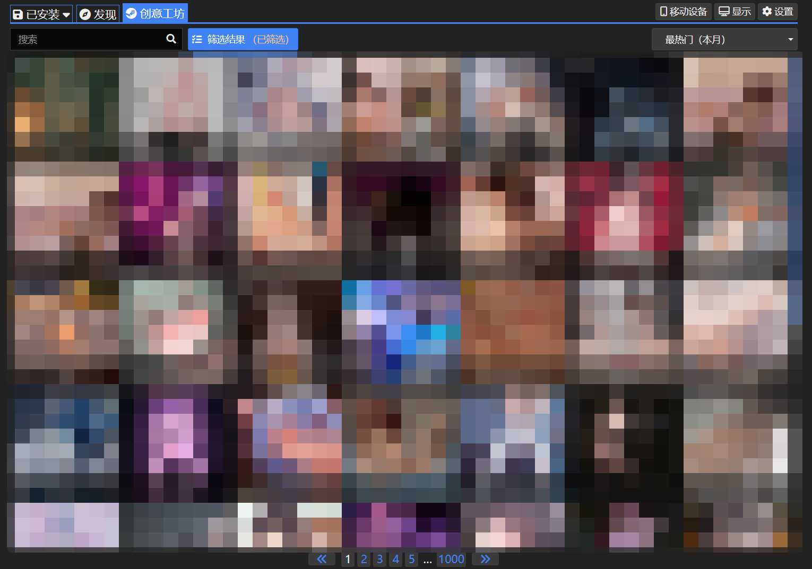
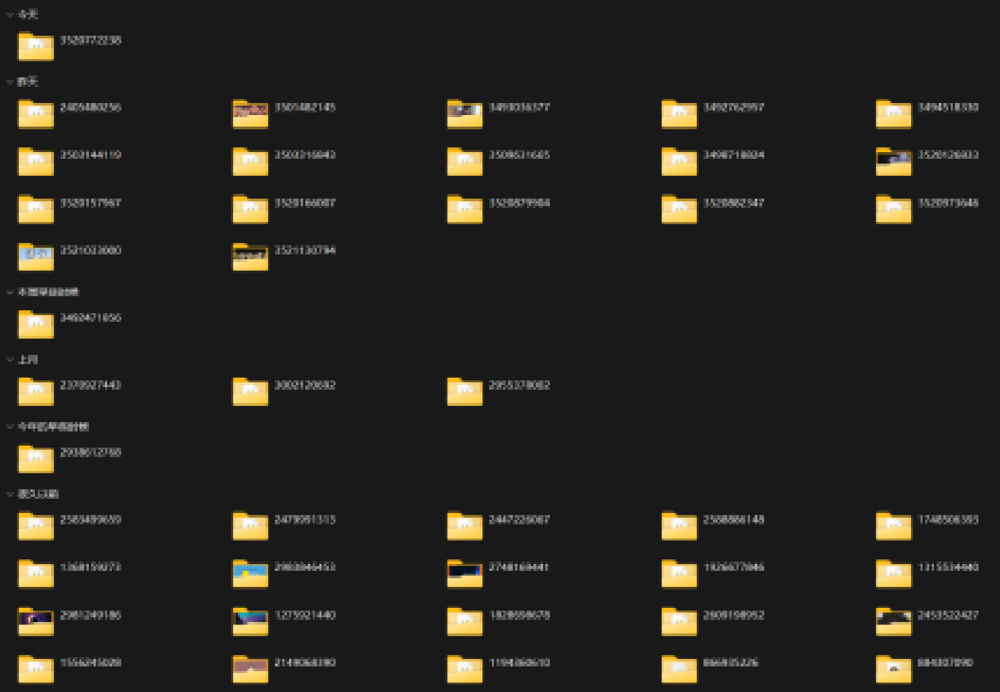
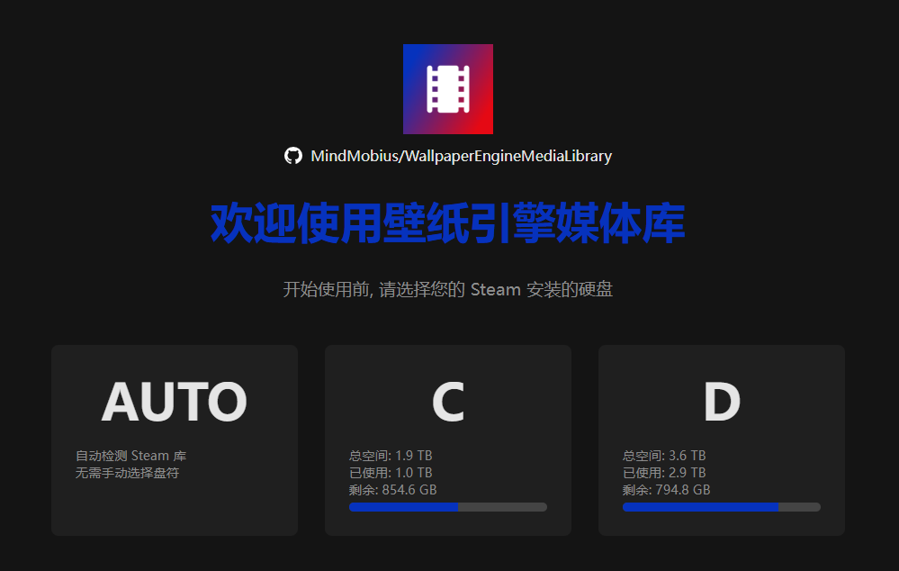
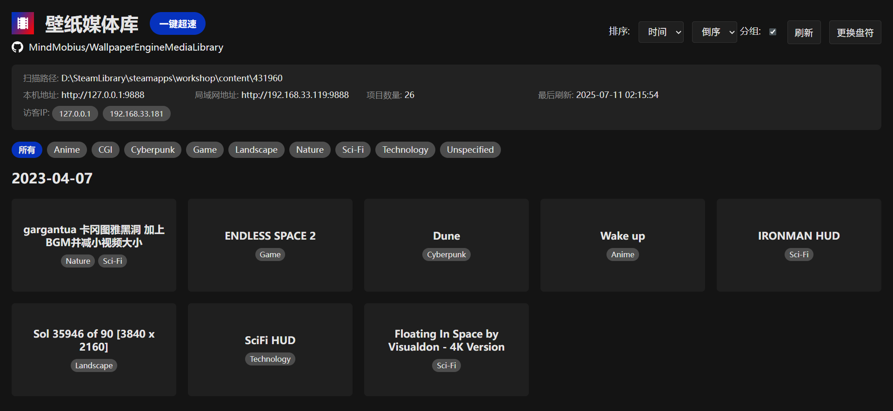
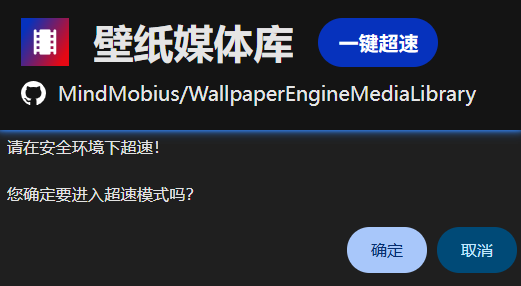
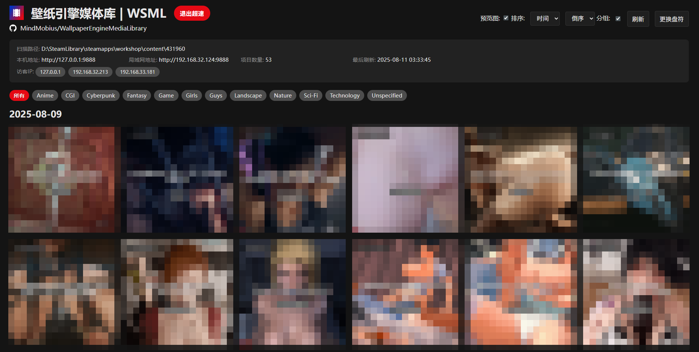
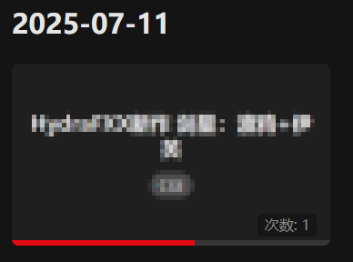
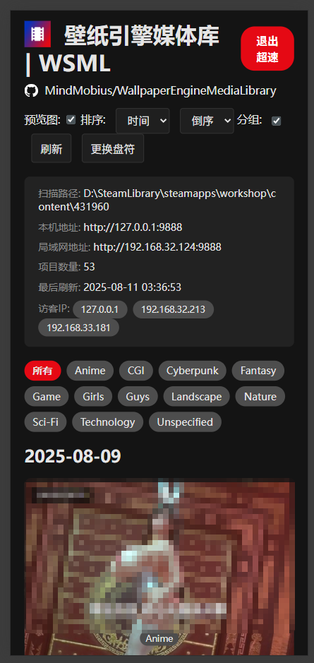

# 壁纸引擎媒体库 WEML
# Wallpaper Engine Media Library

一键将你本地的 Wallpaper Engine 仓库变成一个可通过浏览器访问的个人媒体库，支持多端访问和数据同步。

## 痛点

你是否遇到过以下问题？

*   在Wallpaper Engine的创意工坊订阅了大量壁纸，下载完成后难以直接浏览，只能在文件夹中逐个查看。
    
*   文件夹名称是纯数字 ID，难以记忆，退出后就忘记上次看了哪个文件。
    
*   壁纸存储在电脑上，但想在手机或平板上欣赏，配置远程访问又过于麻烦。

## 解决方案

Wallpaper Engine Media Library (WEML) 帮你轻松解决这些问题！

*   **超轻量设计**：运行后通过浏览器访问即可进入初始界面。
    
*   **便捷的媒体库**：手动选择 Wallpaper Engine 下载目录，即可进入 WEML。默认只显示安全内容。
    
*   **超速模式**：开启后，你就能看到你精选的壁纸。
    
*   **智能排序**：壁纸卡片按照日期、时间或名称排序，卡片上直接显示壁纸标题。
    
*   **在线预览**：点击壁纸卡片，即可在浏览器中直接欣赏壁纸。
    
*   **播放记录**：记录查看次数和上次播放进度，方便下次快速定位。
    
*   **多端同步**：在同一局域网内，多设备通过浏览器访问，数据实时同步。
    

>   **提示**：如果无法访问，请检查电脑防火墙是否关闭，或端口 9888 是否开放。

## 运行

1.  **安装依赖**

    ```bash
    pip install -r requirements.txt
    ```

    这会自动安装所有必需的库。

2.  **运行服务器**

    *   **默认运行:**

        ```bash
        python we_server.py
        ```

    *   **自定义端口:**

        ```bash
        python we_server.py --port 8080
        ```

        服务器将在 `http://127.0.0.1:8080` 上运行。

## 期待你的反馈

欢迎提出 issue，分享你的 bug、建议和 idea。如果你觉得这个项目还不错，请点个 star，让更多人发现它！

## 免责声明

*   本项目仅为壁纸内容浏览技术分享，不涉及内容分发、存储、引导或下载。
*   Wallpaper Engine 是 Steam 上发行的软件。本项目不涉及对其内容的修改和二次分发。请支持正版：[Wallpaper_Engine](https://store.steampowered.com/app/431960/Wallpaper_Engine/)
