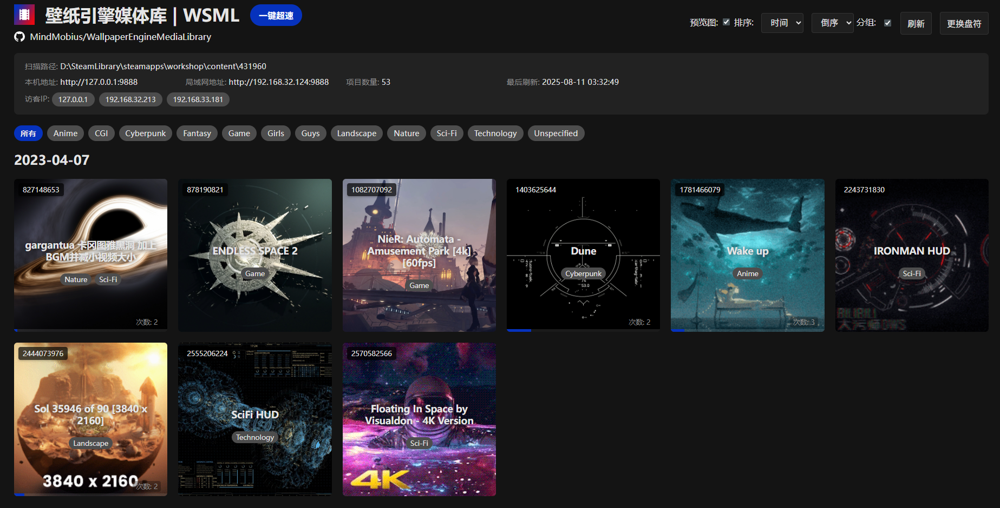

# 壁纸引擎媒体库 WEML
# Wallpaper Engine Media Library

一键将你本地的 Wallpaper Engine 仓库变成一个可通过浏览器访问的个人媒体库，支持多端访问和数据同步。

## 痛点

你是否遇到过以下问题？

*   在Wallpaper Engine的创意工坊订阅了大量壁纸，下载完成后难以直接浏览，只能在文件夹中逐个查看。

    
*   文件夹名称是纯数字 ID，难以记忆，退出后就忘记上次看了哪个文件。

    
*   壁纸存储在电脑上，但想在手机或平板上欣赏，配置远程访问又过于麻烦。

## 解决方案

Wallpaper Engine Media Library (WEML) 帮你轻松解决这些问题！

*   **超轻量设计**：运行后通过浏览器访问即可进入初始界面。自动识别 Wallpaper Engine 的路径，点击AUTO即可进入 WEML。
    
    
*   **便捷的媒体库**：默认只显示安全内容。卡片支持显示预览图（默认关闭）和文件夹名称，方便快速定位。

    
*   **超速模式**：开启后，你就能看到你精选的壁纸。

    
*   **智能排序**：壁纸卡片按照日期、时间或名称排序，

    
*   **在线预览**：点击壁纸卡片，即可在浏览器中直接欣赏壁纸。

    
*   **播放记录**：记录查看次数和上次播放进度，方便下次快速定位。

    
*   **多端同步**：在同一局域网内，多设备通过浏览器访问，数据实时同步。支持手机、平板等移动设备。
  
    
    

>   **提示**：如果无法访问，请检查电脑防火墙是否关闭，或端口 9888 是否开放。
## 使用

### 直接下载

已打包好的exe文件，下载后双击直接运行即可：[WEMLv1.1.0.exe](https://github.com/MindMobius/WallpaperEngineMediaLibrary/releases/download/v1.1.0/WEMLv1.1.0.exe)

### 编译开发
在Python环境开发

1.  **安装依赖**

    ```bash
    pip install -r requirements.txt
    ```

    安装项目所需的所有依赖库。

2.  **运行服务器**

    *   **默认端口:**

        ```bash
        python we_server.py
        ```

    *   **自定义端口:**

        ```bash
        python we_server.py --port 8080
        ```

        服务器将在 `http://127.0.0.1:8080` 启动。

3.  **编译打包exe**

    ```bash
    pyinstaller WEML.spec
    ```

## 期待你的反馈

欢迎提出 issue，分享你的 bug、建议和 idea。如果你觉得这个项目还不错，请点个 star，让更多人发现它！

## 免责声明

*   本项目仅为壁纸内容浏览技术分享，不涉及内容分发、存储、引导或下载。
*   Wallpaper Engine 是 Steam 上发行的软件。本项目不涉及对其内容的修改和二次分发。请支持正版：[Wallpaper_Engine](https://store.steampowered.com/app/431960/Wallpaper_Engine/)

## 更新日志

### v1.1.0 (2025-08-11)
- 优化 Steam 库检索逻辑，自动识别壁纸库路径
- 增加预览图显示开关，用户可自行选择是否展示
- 显示文件夹名（即 ID），方便识别壁纸
- 改进分级读取机制，避免识别错误
- 修复类型读取异常问题，避免遗漏